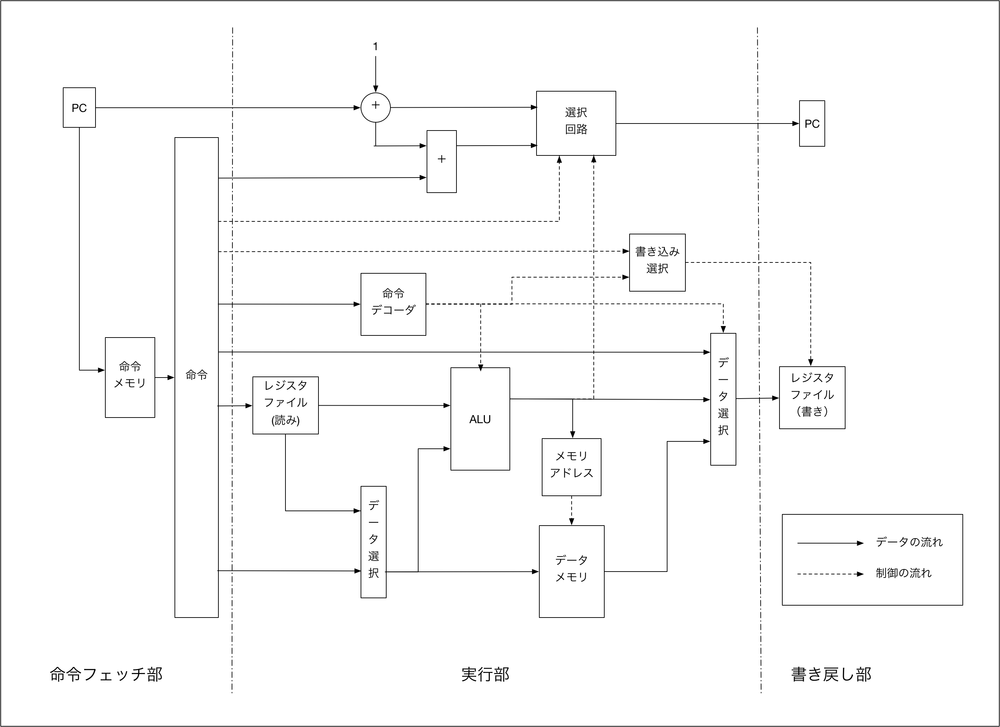

# コンピュータアーキテクチャレポート

今回の課題のソースコードは、[https://github.com/kawasin73/computer-architecture-3s](https://github.com/kawasin73/computer-architecture-3s)にアップロードしている。

## 課題1

> この授業で設計したプロセッサのアセンブラをPerlで実装せよ

Go言語で実装した。`main.go` と `asm/main.go` に実装されてる。
Perl実装からの追加機能として `;` から始まる文字列を無視する、コメントアウト機能を実装した。
また、アセンブリ言語で実装されたファイルを複数結合してバイナリ文字列に変換する機能も追加で実装した。

ソースコードは付録Aに記載する

## 課題2

> 1 + 1 = 2 などをアセンブルする

アセンブリコードは以下の通り

```:sample.asm
addi r1, r0, 1
addi r2, r0, 1
add r3, r1, r2
```

以下のコマンドでマシン語の変換を行う

```
go run main.go report/sample.asm > report/sample.bin
```

出力された0,1のコードは以下の通り

```:sample.bin
000001_00000_00001_0000000000000001_
000001_00000_00010_0000000000000001_
000000_00001_00010_00011_00000000000_

```

## 課題3

> この授業でとりあげたプロセッサは、メモリアドレスの算出に専用の加算器を用いていた。これを用いることなく、既 存の ALU をアドレス算出用の加算器として使いたい。

### 3.1

> 目的とするプロセッサのブロック図を書け



### 3.2

> Verilog HDL による記述を修正して、目的とするプロセッサの記述とせよ。解答は Verilog HDL のソース(修正箇所
のみで良い)で示せ

教科書からの差分は以下の２点である。また、全ての実装は、付録B に記載する

- `execute` モジュールの `opr_gen` 関数にメモリ計算するためのオペレーション設定 (`6'd16, 6'd18, 6'd20, 6'd24, 6'd26, 6'd28`) を追加した。
  ```
    function [4:0] opr_gen;
      input [5:0] op;
      input [4:0] operation;

      case (op)
        6'd0: opr_gen = operation;
        6'd1: opr_gen = 5'd0;
        6'd4: opr_gen = 5'd8;
        6'd5: opr_gen = 5'd9;
        6'd6: opr_gen = 5'd10;
        6'd16, 6'd18, 6'd20, 6'd24, 6'd26, 6'd28: opr_gen = 5'd0;
        default: opr_gen = 5'h1f;
      endcase
    endfunction
  ```
- また、`execute` モジュールのメモリアドレスは、`alu` の結果を利用するように変更した。
  ```
  assign mem_address = alu_result >>> 2;
  ```

#### 教科書実装とそのバグ

教科書の実装は、github のタグ `v0.1` の、`computer` ディレクトリに実装した。

URL: [https://github.com/kawasin73/computer-architecture-3s/tree/v0.1](https://github.com/kawasin73/computer-architecture-3s/tree/v0.1)

モジュールごとに、`computer/computer.v`、`computer/data_mem.v`、`execute.v`、`fetch.v`、`reg_file.v` にファイル分割して実装した。

後述するテストコードで実装をテストする中で、以下の3つの部分で教科書実装のバグを発見した。

- `alu` 関数の `引き算器` の実装
  - 引き算の `AUX` はアセンブラでは`2` にしてあるが、`alu` 関数のマルチプレクサのキーが `5'd1` になっているため、これを `5'd2` に修正する必要がある。
- `alu` 関数の `算術右シフト` の実装
  - `>>>` は符号の設定されていないオペランドは論理右シフトを行うため、`alu` 関数の引数は、`input signed [31:0] operand1, operand2;` と「符号あり」と指定する必要がある。
  - 参考URL: http://hikalium.hatenablog.jp/entry/2017/07/10/091146
- `alu` 関数の `NOR` の実装
  - `NOR` は、`~(operand1 & operand2)` ではなく、 `~(operand1 | operand2)`

### 3.3

> シミュレーションによってこのプロセッサが正しく動作することを確認せよ。確認は、アセンブリ言語で書いたプログラムをアセンブラで機械語に翻訳し、これを Modelsim にかけることで行え。解答は Modelsim の出力・メモリダンプなどで示せ。

テストのため、全ての命令を網羅したアセンブリ言語のテストコードを用意した。このコードを実行すると、0 ~ 31 までのレジスタに値が設定される。その生成結果とあらかじめ生成した模範解答とを差し合わせることで正しい実装になっているかどうかを検証した。

#### ModelSim で実行するコマンド

```
vsim work.test_computer
run 6000
mem save -o sample.mem -f mti -data symbolic -addr hex /test_computer/computer_body/rf_body/rf
mem save -o data0.mem -f mti -data symbolic -addr hex /test_computer/computer_body/execute_body/data_mem_body0/d_mem
mem save -o data1.mem -f mti -data symbolic -addr hex /test_computer/computer_body/execute_body/data_mem_body1/d_mem
mem save -o data2.mem -f mti -data symbolic -addr hex /test_computer/computer_body/execute_body/data_mem_body2/d_mem
mem save -o data3.mem -f mti -data symbolic -addr hex /test_computer/computer_body/execute_body/data_mem_body3/d_mem
```

#### レジスタテスト結果(sample.mem)

```
// memory data file (do not edit the following line - required for mem load use)
// instance=/test_computer/computer_body/rf_body/rf
// format=mti addressradix=h dataradix=s version=1.0 wordsperline=2
 0: 00000000000000000000000000000000 00000000000000000000000000000101
 2: 00000000000000000000000011111111 00000000000000000000000000000111
 4: 00000000000000000000000100000100 00000000000000000000000011111010
 6: 00000000000011110000000000000000 00000000000000000000000000000100
 8: 00000000000000000000000000001010 00000000000011110000000011111111
 a: 00000000000011110000000000001111 00000000000000000000000011111101
 c: 00000000000000000000000000001101 11111111111111111111111011111000
 e: 00000000000001110000000000000000 00111111111111111111111110111110
10: 00000000000000000000000001000001 11111111111111111111111110111110
12: 00000000000000000000000001000001 01010101010101010101010101010101
14: 01010101010101010101010101010101 00000000000000000101010101010101
16: 00000000000000000000000001010101 00000000000000000000000000000011
18: 00000000000000000000000000000010 00000000000000000000000000010000
1a: 00000000000000000000000000100001 00000000000000000000000000110110
1c: 00000000000000000000000000100011 00000000000000000000000000100111
1e: 00000000000000000000000001111110 00000000000000000000000000111001

```

#### メモリテスト結果(data0.mem)

```
// memory data file (do not edit the following line - required for mem load use)
// instance=/test_computer/computer_body/execute_body/data_mem_body0/d_mem
// format=mti addressradix=h dataradix=s version=1.0 wordsperline=8
 0: 01010101 01010101 01010101 xxxxxxxx xxxxxxxx xxxxxxxx xxxxxxxx xxxxxxxx
 8: xxxxxxxx xxxxxxxx xxxxxxxx xxxxxxxx xxxxxxxx xxxxxxxx xxxxxxxx xxxxxxxx
10: xxxxxxxx xxxxxxxx xxxxxxxx xxxxxxxx xxxxxxxx xxxxxxxx xxxxxxxx xxxxxxxx
// 以下省略

```

#### メモリテスト結果(data1.mem)

```
// memory data file (do not edit the following line - required for mem load use)
// instance=/test_computer/computer_body/execute_body/data_mem_body1/d_mem
// format=mti addressradix=h dataradix=s version=1.0 wordsperline=8
 0: 01010101 01010101 xxxxxxxx xxxxxxxx xxxxxxxx xxxxxxxx xxxxxxxx xxxxxxxx
 8: xxxxxxxx xxxxxxxx xxxxxxxx xxxxxxxx xxxxxxxx xxxxxxxx xxxxxxxx xxxxxxxx
10: xxxxxxxx xxxxxxxx xxxxxxxx xxxxxxxx xxxxxxxx xxxxxxxx xxxxxxxx xxxxxxxx
18: xxxxxxxx xxxxxxxx xxxxxxxx xxxxxxxx xxxxxxxx xxxxxxxx xxxxxxxx xxxxxxxx
// 以下省略

```

#### メモリテスト結果(data2.mem)

```
// memory data file (do not edit the following line - required for mem load use)
// instance=/test_computer/computer_body/execute_body/data_mem_body2/d_mem
// format=mti addressradix=h dataradix=s version=1.0 wordsperline=8
 0: 01010101 xxxxxxxx xxxxxxxx xxxxxxxx xxxxxxxx xxxxxxxx xxxxxxxx xxxxxxxx
 8: xxxxxxxx xxxxxxxx xxxxxxxx xxxxxxxx xxxxxxxx xxxxxxxx xxxxxxxx xxxxxxxx
10: xxxxxxxx xxxxxxxx xxxxxxxx xxxxxxxx xxxxxxxx xxxxxxxx xxxxxxxx xxxxxxxx
18: xxxxxxxx xxxxxxxx xxxxxxxx xxxxxxxx xxxxxxxx xxxxxxxx xxxxxxxx xxxxxxxx
// 以下省略

```

#### メモリテスト結果(data3.mem)

```
// memory data file (do not edit the following line - required for mem load use)
// instance=/test_computer/computer_body/execute_body/data_mem_body3/d_mem
// format=mti addressradix=h dataradix=s version=1.0 wordsperline=8
 0: 01010101 xxxxxxxx xxxxxxxx xxxxxxxx xxxxxxxx xxxxxxxx xxxxxxxx xxxxxxxx
 8: xxxxxxxx xxxxxxxx xxxxxxxx xxxxxxxx xxxxxxxx xxxxxxxx xxxxxxxx xxxxxxxx
10: xxxxxxxx xxxxxxxx xxxxxxxx xxxxxxxx xxxxxxxx xxxxxxxx xxxxxxxx xxxxxxxx
18: xxxxxxxx xxxxxxxx xxxxxxxx xxxxxxxx xxxxxxxx xxxxxxxx xxxxxxxx xxxxxxxx
// 以下省略

```

#### アセンブリテストコード

**注意事項** 各行の `;` 以降の部分はコメントとして無視されてアセンブルされている。

```
addi r1, r0, 5
addi r2, r0, 255
addi r3, r1, 2 ; test addi
add r4, r2, r1 ; test add
sub r5, r2, r1 ; test sub
lui r6, 15 ; test lui
and r7, r3, r4 ; test and
andi r8, r5, 15 ;test andi
or r9, r2, r6 ;   test or
ori r10, r6, 15 ; test ori
xor r11, r3, r5 ; test xor
xori r12, r3, 10;test xori
nor r13, r3, r4; test nor
sll r14, r3, 16; test sll
srl r15, r13, 2; test srl
srl r16, r4, 2; test srl
sra r17, r13, 2; test sra
sra r18, r4, 2; test sra
lui r19, 21845
addi r19, r19, 21845; r19 = 32'b01010101010101010101010101010101
sw r19, 0(r0) ; test sw
sh r19, 4(r0) ; test sh
sb r19, 8(r0) ; test sb
lw r20, 0(r0) ; test lw
lh r21, 0(r0) ;  test lh
lb r22, 0(r0) ;  test hb
addi r23, r0, 1 ; r23 will change to 3
addi r24, r0, 2
beq r24, r23, label1 ; not go
label2: addi r23, r23, 1 ; addi twice
beq r24, r23, label2 ; once go to label2
label1: addi r0, r0, 0 ; test beq
addi r25, r0, 2
bne r24, r25, label3 ; not go
addi r25, r0, 0 ; will reset to 0
bne r24, r25, label4 ; should jump
label3: addi r25, r25, 8 ; will not exected
label4: addi r25, r25, 16 ; test bne r25 == 32'b00000000000000000000000000010000
addi r26, r0, 2
blt r24, r26, label5 ; not jump
addi r26, r0, 1 ; change to 1
blt r24, r26, label6 ; should jump
label5: addi r26, r26, 16
label6: addi r26, r26, 32 ; test blt r26 == 32'b00000000000000000000000000100001
addi r27, r0, 2
ble r24, r27, label7 ; should jump
addi r27, r0, 1 ; not executed
label7: addi r27, r27, 16
blt r24, r27, label8 ; not jump
addi r27, r27, 4
label8: addi r27, r27, 32 ; test blt r27 == 32'b00000000000000000000000000110110
addi r28, r0, 3
j label9
addi r28, r28, 16
label9: addi, r28, r28, 32 ; test j  r28 == 32'00000000000000000000000000100011
addi r29, r0, 7
jal label10
addi r29, r29, 16
label10: addi r29, r29, 32 ; test jal r29 == 32'b00000000000000000000000000100111
addi r30, r0, 62
jr r30
addi r30, r30, 2
addi r30, r30, 64 ; test jr r30 == 32'b00000000000000000000000001111110

```

#### monitor の出力結果

```
#   0rstd=1, clk=0, pc=  x, nextpc=  x, ins=xxxxxxxx, wra=00, reg1=xxxxxxxx, reg2=xxxxxxxx
#  10rstd=0, clk=0, pc=  0, nextpc=  1, ins=04010005, wra=01, reg1=00000000, reg2=xxxxxxxx
#  20rstd=1, clk=0, pc=  0, nextpc=  1, ins=04010005, wra=01, reg1=00000000, reg2=xxxxxxxx
#  50rstd=1, clk=1, pc=  1, nextpc=  2, ins=040200ff, wra=02, reg1=00000000, reg2=xxxxxxxx
# 100rstd=1, clk=0, pc=  1, nextpc=  2, ins=040200ff, wra=02, reg1=00000000, reg2=xxxxxxxx
# 150rstd=1, clk=1, pc=  2, nextpc=  3, ins=04230002, wra=03, reg1=00000005, reg2=xxxxxxxx
# 200rstd=1, clk=0, pc=  2, nextpc=  3, ins=04230002, wra=03, reg1=00000005, reg2=xxxxxxxx
# 250rstd=1, clk=1, pc=  3, nextpc=  4, ins=00412000, wra=04, reg1=000000ff, reg2=00000005
# 300rstd=1, clk=0, pc=  3, nextpc=  4, ins=00412000, wra=04, reg1=000000ff, reg2=00000005
# 350rstd=1, clk=1, pc=  4, nextpc=  5, ins=00412802, wra=05, reg1=000000ff, reg2=00000005
# 400rstd=1, clk=0, pc=  4, nextpc=  5, ins=00412802, wra=05, reg1=000000ff, reg2=00000005
# 450rstd=1, clk=1, pc=  5, nextpc=  6, ins=0c06000f, wra=06, reg1=00000000, reg2=xxxxxxxx
# 500rstd=1, clk=0, pc=  5, nextpc=  6, ins=0c06000f, wra=06, reg1=00000000, reg2=xxxxxxxx
# 550rstd=1, clk=1, pc=  6, nextpc=  7, ins=00643808, wra=07, reg1=00000007, reg2=00000104
# 600rstd=1, clk=0, pc=  6, nextpc=  7, ins=00643808, wra=07, reg1=00000007, reg2=00000104
# 650rstd=1, clk=1, pc=  7, nextpc=  8, ins=10a8000f, wra=08, reg1=000000fa, reg2=xxxxxxxx
# 700rstd=1, clk=0, pc=  7, nextpc=  8, ins=10a8000f, wra=08, reg1=000000fa, reg2=xxxxxxxx
# 750rstd=1, clk=1, pc=  8, nextpc=  9, ins=00464809, wra=09, reg1=000000ff, reg2=000f0000
# 800rstd=1, clk=0, pc=  8, nextpc=  9, ins=00464809, wra=09, reg1=000000ff, reg2=000f0000
# 850rstd=1, clk=1, pc=  9, nextpc= 10, ins=14ca000f, wra=0a, reg1=000f0000, reg2=xxxxxxxx
# 900rstd=1, clk=0, pc=  9, nextpc= 10, ins=14ca000f, wra=0a, reg1=000f0000, reg2=xxxxxxxx
# 950rstd=1, clk=1, pc= 10, nextpc= 11, ins=0065580a, wra=0b, reg1=00000007, reg2=000000fa
#1000rstd=1, clk=0, pc= 10, nextpc= 11, ins=0065580a, wra=0b, reg1=00000007, reg2=000000fa
#1050rstd=1, clk=1, pc= 11, nextpc= 12, ins=186c000a, wra=0c, reg1=00000007, reg2=xxxxxxxx
#1100rstd=1, clk=0, pc= 11, nextpc= 12, ins=186c000a, wra=0c, reg1=00000007, reg2=xxxxxxxx
#1150rstd=1, clk=1, pc= 12, nextpc= 13, ins=0064680b, wra=0d, reg1=00000007, reg2=00000104
#1200rstd=1, clk=0, pc= 12, nextpc= 13, ins=0064680b, wra=0d, reg1=00000007, reg2=00000104
#1250rstd=1, clk=1, pc= 13, nextpc= 14, ins=00607410, wra=0e, reg1=00000007, reg2=00000000
#1300rstd=1, clk=0, pc= 13, nextpc= 14, ins=00607410, wra=0e, reg1=00000007, reg2=00000000
#1350rstd=1, clk=1, pc= 14, nextpc= 15, ins=01a07891, wra=0f, reg1=fffffef8, reg2=00000000
#1400rstd=1, clk=0, pc= 14, nextpc= 15, ins=01a07891, wra=0f, reg1=fffffef8, reg2=00000000
#1450rstd=1, clk=1, pc= 15, nextpc= 16, ins=00808091, wra=10, reg1=00000104, reg2=00000000
#1500rstd=1, clk=0, pc= 15, nextpc= 16, ins=00808091, wra=10, reg1=00000104, reg2=00000000
#1550rstd=1, clk=1, pc= 16, nextpc= 17, ins=01a08892, wra=11, reg1=fffffef8, reg2=00000000
#1600rstd=1, clk=0, pc= 16, nextpc= 17, ins=01a08892, wra=11, reg1=fffffef8, reg2=00000000
#1650rstd=1, clk=1, pc= 17, nextpc= 18, ins=00809092, wra=12, reg1=00000104, reg2=00000000
#1700rstd=1, clk=0, pc= 17, nextpc= 18, ins=00809092, wra=12, reg1=00000104, reg2=00000000
#1750rstd=1, clk=1, pc= 18, nextpc= 19, ins=0c135555, wra=13, reg1=00000000, reg2=xxxxxxxx
#1800rstd=1, clk=0, pc= 18, nextpc= 19, ins=0c135555, wra=13, reg1=00000000, reg2=xxxxxxxx
#1850rstd=1, clk=1, pc= 19, nextpc= 20, ins=06735555, wra=13, reg1=55550000, reg2=55550000
#1900rstd=1, clk=0, pc= 19, nextpc= 20, ins=06735555, wra=13, reg1=55550000, reg2=55550000
#1950rstd=1, clk=1, pc= 20, nextpc= 21, ins=60130000, wra=00, reg1=00000000, reg2=55555555
#2000rstd=1, clk=0, pc= 20, nextpc= 21, ins=60130000, wra=00, reg1=00000000, reg2=55555555
#2050rstd=1, clk=1, pc= 21, nextpc= 22, ins=68130004, wra=00, reg1=00000000, reg2=55555555
#2100rstd=1, clk=0, pc= 21, nextpc= 22, ins=68130004, wra=00, reg1=00000000, reg2=55555555
#2150rstd=1, clk=1, pc= 22, nextpc= 23, ins=70130008, wra=00, reg1=00000000, reg2=55555555
#2200rstd=1, clk=0, pc= 22, nextpc= 23, ins=70130008, wra=00, reg1=00000000, reg2=55555555
#2250rstd=1, clk=1, pc= 23, nextpc= 24, ins=40140000, wra=14, reg1=00000000, reg2=xxxxxxxx
#2300rstd=1, clk=0, pc= 23, nextpc= 24, ins=40140000, wra=14, reg1=00000000, reg2=xxxxxxxx
#2350rstd=1, clk=1, pc= 24, nextpc= 25, ins=48150000, wra=15, reg1=00000000, reg2=xxxxxxxx
#2400rstd=1, clk=0, pc= 24, nextpc= 25, ins=48150000, wra=15, reg1=00000000, reg2=xxxxxxxx
#2450rstd=1, clk=1, pc= 25, nextpc= 26, ins=50160000, wra=16, reg1=00000000, reg2=xxxxxxxx
#2500rstd=1, clk=0, pc= 25, nextpc= 26, ins=50160000, wra=16, reg1=00000000, reg2=xxxxxxxx
#2550rstd=1, clk=1, pc= 26, nextpc= 27, ins=04170001, wra=17, reg1=00000000, reg2=xxxxxxxx
#2600rstd=1, clk=0, pc= 26, nextpc= 27, ins=04170001, wra=17, reg1=00000000, reg2=xxxxxxxx
#2650rstd=1, clk=1, pc= 27, nextpc= 28, ins=04180002, wra=18, reg1=00000000, reg2=xxxxxxxx
#2700rstd=1, clk=0, pc= 27, nextpc= 28, ins=04180002, wra=18, reg1=00000000, reg2=xxxxxxxx
#2750rstd=1, clk=1, pc= 28, nextpc= 29, ins=82f80002, wra=00, reg1=00000001, reg2=00000002
#2800rstd=1, clk=0, pc= 28, nextpc= 29, ins=82f80002, wra=00, reg1=00000001, reg2=00000002
#2850rstd=1, clk=1, pc= 29, nextpc= 30, ins=06f70001, wra=17, reg1=00000001, reg2=00000001
#2900rstd=1, clk=0, pc= 29, nextpc= 30, ins=06f70001, wra=17, reg1=00000001, reg2=00000001
#2950rstd=1, clk=1, pc= 30, nextpc= 29, ins=82f8fffe, wra=00, reg1=00000002, reg2=00000002
#3000rstd=1, clk=0, pc= 30, nextpc= 29, ins=82f8fffe, wra=00, reg1=00000002, reg2=00000002
#3050rstd=1, clk=1, pc= 29, nextpc= 30, ins=06f70001, wra=17, reg1=00000002, reg2=00000002
#3100rstd=1, clk=0, pc= 29, nextpc= 30, ins=06f70001, wra=17, reg1=00000002, reg2=00000002
#3150rstd=1, clk=1, pc= 30, nextpc= 31, ins=82f8fffe, wra=00, reg1=00000003, reg2=00000002
#3200rstd=1, clk=0, pc= 30, nextpc= 31, ins=82f8fffe, wra=00, reg1=00000003, reg2=00000002
#3250rstd=1, clk=1, pc= 31, nextpc= 32, ins=04000000, wra=00, reg1=00000000, reg2=00000000
#3300rstd=1, clk=0, pc= 31, nextpc= 32, ins=04000000, wra=00, reg1=00000000, reg2=00000000
#3350rstd=1, clk=1, pc= 32, nextpc= 33, ins=04190002, wra=19, reg1=00000000, reg2=xxxxxxxx
#3400rstd=1, clk=0, pc= 32, nextpc= 33, ins=04190002, wra=19, reg1=00000000, reg2=xxxxxxxx
#3450rstd=1, clk=1, pc= 33, nextpc= 34, ins=87380002, wra=00, reg1=00000002, reg2=00000002
#3500rstd=1, clk=0, pc= 33, nextpc= 34, ins=87380002, wra=00, reg1=00000002, reg2=00000002
#3550rstd=1, clk=1, pc= 34, nextpc= 35, ins=04190000, wra=19, reg1=00000000, reg2=00000002
#3600rstd=1, clk=0, pc= 34, nextpc= 35, ins=04190000, wra=19, reg1=00000000, reg2=00000002
#3650rstd=1, clk=1, pc= 35, nextpc= 37, ins=87380001, wra=00, reg1=00000000, reg2=00000002
#3700rstd=1, clk=0, pc= 35, nextpc= 37, ins=87380001, wra=00, reg1=00000000, reg2=00000002
#3750rstd=1, clk=1, pc= 37, nextpc= 38, ins=07390010, wra=19, reg1=00000000, reg2=00000000
#3800rstd=1, clk=0, pc= 37, nextpc= 38, ins=07390010, wra=19, reg1=00000000, reg2=00000000
#3850rstd=1, clk=1, pc= 38, nextpc= 39, ins=041a0002, wra=1a, reg1=00000000, reg2=xxxxxxxx
#3900rstd=1, clk=0, pc= 38, nextpc= 39, ins=041a0002, wra=1a, reg1=00000000, reg2=xxxxxxxx
#3950rstd=1, clk=1, pc= 39, nextpc= 40, ins=8b580002, wra=00, reg1=00000002, reg2=00000002
#4000rstd=1, clk=0, pc= 39, nextpc= 40, ins=8b580002, wra=00, reg1=00000002, reg2=00000002
#4050rstd=1, clk=1, pc= 40, nextpc= 41, ins=041a0001, wra=1a, reg1=00000000, reg2=00000002
#4100rstd=1, clk=0, pc= 40, nextpc= 41, ins=041a0001, wra=1a, reg1=00000000, reg2=00000002
#4150rstd=1, clk=1, pc= 41, nextpc= 43, ins=8b580001, wra=00, reg1=00000001, reg2=00000002
#4200rstd=1, clk=0, pc= 41, nextpc= 43, ins=8b580001, wra=00, reg1=00000001, reg2=00000002
#4250rstd=1, clk=1, pc= 43, nextpc= 44, ins=075a0020, wra=1a, reg1=00000001, reg2=00000001
#4300rstd=1, clk=0, pc= 43, nextpc= 44, ins=075a0020, wra=1a, reg1=00000001, reg2=00000001
#4350rstd=1, clk=1, pc= 44, nextpc= 45, ins=041b0002, wra=1b, reg1=00000000, reg2=xxxxxxxx
#4400rstd=1, clk=0, pc= 44, nextpc= 45, ins=041b0002, wra=1b, reg1=00000000, reg2=xxxxxxxx
#4450rstd=1, clk=1, pc= 45, nextpc= 47, ins=8f780001, wra=00, reg1=00000002, reg2=00000002
#4500rstd=1, clk=0, pc= 45, nextpc= 47, ins=8f780001, wra=00, reg1=00000002, reg2=00000002
#4550rstd=1, clk=1, pc= 47, nextpc= 48, ins=077b0010, wra=1b, reg1=00000002, reg2=00000002
#4600rstd=1, clk=0, pc= 47, nextpc= 48, ins=077b0010, wra=1b, reg1=00000002, reg2=00000002
#4650rstd=1, clk=1, pc= 48, nextpc= 49, ins=8b780001, wra=00, reg1=00000012, reg2=00000002
#4700rstd=1, clk=0, pc= 48, nextpc= 49, ins=8b780001, wra=00, reg1=00000012, reg2=00000002
#4750rstd=1, clk=1, pc= 49, nextpc= 50, ins=077b0004, wra=1b, reg1=00000012, reg2=00000012
#4800rstd=1, clk=0, pc= 49, nextpc= 50, ins=077b0004, wra=1b, reg1=00000012, reg2=00000012
#4850rstd=1, clk=1, pc= 50, nextpc= 51, ins=077b0020, wra=1b, reg1=00000016, reg2=00000016
#4900rstd=1, clk=0, pc= 50, nextpc= 51, ins=077b0020, wra=1b, reg1=00000016, reg2=00000016
#4950rstd=1, clk=1, pc= 51, nextpc= 52, ins=041c0003, wra=1c, reg1=00000000, reg2=xxxxxxxx
#5000rstd=1, clk=0, pc= 51, nextpc= 52, ins=041c0003, wra=1c, reg1=00000000, reg2=xxxxxxxx
#5050rstd=1, clk=1, pc= 52, nextpc= 54, ins=a0000036, wra=00, reg1=00000000, reg2=00000000
#5100rstd=1, clk=0, pc= 52, nextpc= 54, ins=a0000036, wra=00, reg1=00000000, reg2=00000000
#5150rstd=1, clk=1, pc= 54, nextpc= 55, ins=079c0020, wra=1c, reg1=00000003, reg2=00000003
#5200rstd=1, clk=0, pc= 54, nextpc= 55, ins=079c0020, wra=1c, reg1=00000003, reg2=00000003
#5250rstd=1, clk=1, pc= 55, nextpc= 56, ins=041d0007, wra=1d, reg1=00000000, reg2=xxxxxxxx
#5300rstd=1, clk=0, pc= 55, nextpc= 56, ins=041d0007, wra=1d, reg1=00000000, reg2=xxxxxxxx
#5350rstd=1, clk=1, pc= 56, nextpc= 58, ins=a400003a, wra=1f, reg1=00000000, reg2=00000000
#5400rstd=1, clk=0, pc= 56, nextpc= 58, ins=a400003a, wra=1f, reg1=00000000, reg2=00000000
#5450rstd=1, clk=1, pc= 58, nextpc= 59, ins=07bd0020, wra=1d, reg1=00000007, reg2=00000007
#5500rstd=1, clk=0, pc= 58, nextpc= 59, ins=07bd0020, wra=1d, reg1=00000007, reg2=00000007
#5550rstd=1, clk=1, pc= 59, nextpc= 60, ins=041e003e, wra=1e, reg1=00000000, reg2=xxxxxxxx
#5600rstd=1, clk=0, pc= 59, nextpc= 60, ins=041e003e, wra=1e, reg1=00000000, reg2=xxxxxxxx
#5650rstd=1, clk=1, pc= 60, nextpc= 62, ins=abc00000, wra=00, reg1=0000003e, reg2=00000000
#5700rstd=1, clk=0, pc= 60, nextpc= 62, ins=abc00000, wra=00, reg1=0000003e, reg2=00000000
#5750rstd=1, clk=1, pc= 62, nextpc= 63, ins=07de0040, wra=1e, reg1=0000003e, reg2=0000003e
#5800rstd=1, clk=0, pc= 62, nextpc= 63, ins=07de0040, wra=1e, reg1=0000003e, reg2=0000003e
#5850rstd=1, clk=1, pc= 63, nextpc= 64, ins=xxxxxxxx, wra=00, reg1=xxxxxxxx, reg2=xxxxxxxx
#5900rstd=1, clk=0, pc= 63, nextpc= 64, ins=xxxxxxxx, wra=00, reg1=xxxxxxxx, reg2=xxxxxxxx
#5950rstd=1, clk=1, pc= 64, nextpc= 65, ins=xxxxxxxx, wra=00, reg1=xxxxxxxx, reg2=xxxxxxxx
```
